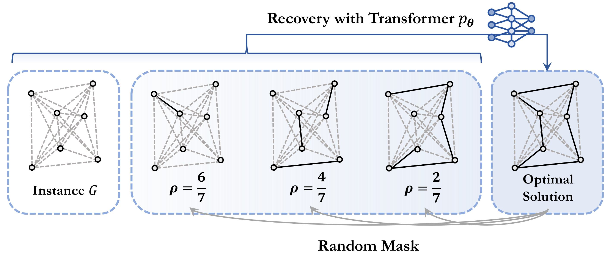
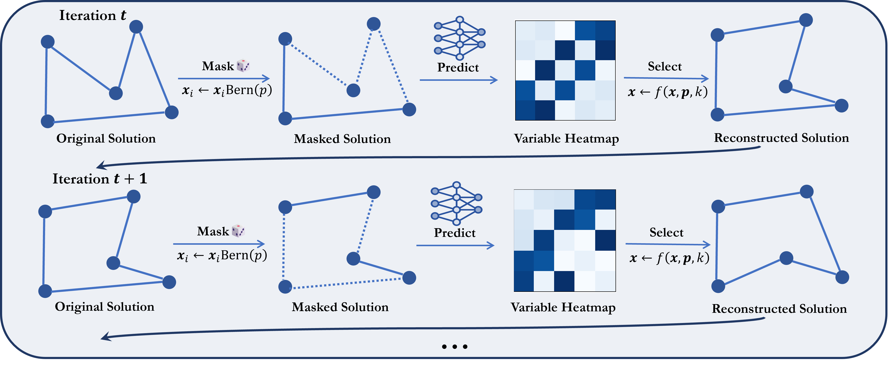

# MaskCO: Masked Generation Drives Effective Representation Learning and Exploiting for Combinatorial Optimization


Official JAX implementation of **ICLR 2026** paper "[MaskCO: Masked Generation Drives Effective Representation Learning and Exploiting for Combinatorial Optimization](https://openreview.net/forum?id=psUjNnLhl9)". A PyTorch version will be released soon.

Neural Combinatorial Optimization (NCO) has long been anchored in paradigms such as solution construction or improvement that treat the solution as a monolithic reference, squandering the rich local decision patterns embedded in high-quality solutions. Inspired by the scalability of self-supervised pretraining in language and vision, we propose a shift in perspective: Can combinatorial optimization adopt a fundamental training paradigm to enable scalable representation learning? We introduce MaskCO, a masked generation approach that reframes learning to optimize as self-supervised learning on given reference solutions. By strategically masking portions of optimal solutions and training models to recover the missing content, MaskCO turns a single instance-solution pair into a multitude of local learning signals, forcing the model to internalize fine-grained structural dependencies. At inference time, we employ a mask-and-reconstruct procedure, i.e., a refinement loop that iteratively masks variables and regenerates them to progressively improve solution quality. Our findings show that these learned representations are highly transferable, facilitating effective fine-tuning and boosting the performance of alternative inference approaches. Experimental results demonstrate that MaskCO achieves remarkable performance improvements over previous state-of-the-art neural solvers, reducing the optimality gap by more than 99% and achieving a 10x speedup on problems such as the Travelling Salesman Problem (TSP).





## Setup
```
sh install.sh
cd lib && make
```

## Data
All datasets can be downloaded from [Hugging Face](https://huggingface.co/datasets/Rick242420/MaskCO) or [Baidu Netdisk](https://pan.baidu.com/s/1eyRkLda-y6VLCgpw0Tfsyw?pwd=fd59). For other details, please refer to `data` folder.

## Checkpoints
Checkpoints can be downloaded from [Google Drive](https://drive.google.com/drive/folders/1Y9kN7H5qvlsgbnOKih6hpkpcF2MHUreI?usp=sharing). To evaluate them, run the scripts in the `tsp_scripts/eval`, `cvrp_scripts/eval`, and `mis_scripts/eval` directories.

## Training  
Training scripts are located in `tsp_scripts/train`, `cvrp_scripts/train`, and `mis_scripts/train`.  

- The TSP-100/500 training data is sourced from [ML4TSPBench](https://github.com/Thinklab-SJTU/ML4TSPBench), TSP-1000 training data is sourced from [ML4CO-Bench-101](https://github.com/Thinklab-SJTU/ML4CO-Bench-101).
- The MIS training data is the same as that used in [Fast-T2T](https://github.com/Thinklab-SJTU/Fast-T2T).  
<!-- - The CVRP training data ... -->


